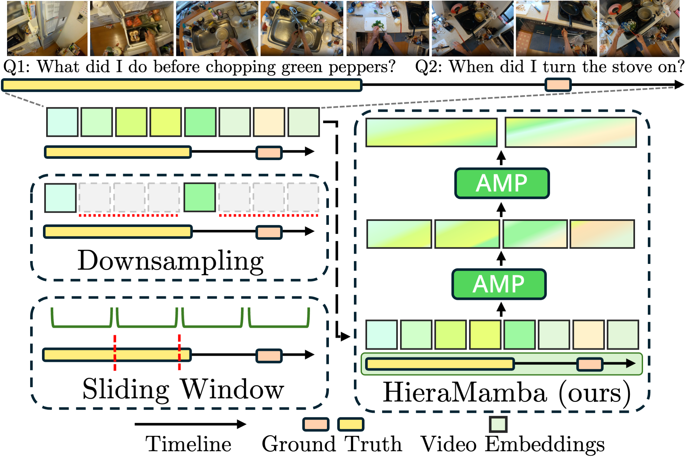

# HieraMamba: Video Temporal Grounding via Hierarchical Anchor-Mamba Pooling

[](https://arxiv.org/abs/2510.23043)
[](https://vision.cs.utexas.edu/projects/hieramamba/)

**Authors:** [Joungbin An](https://sites.google.com/view/joungbinan/), [Kristen Grauman](https://www.cs.utexas.edu/~grauman/)

## 📢 Updates

- **[Mar 2025]** Full code, training pipeline, evaluation scripts, and model checkpoints released!

## 🧭 Overview

HieraMamba utilizes **Mamba's selective state-space modeling** to achieve **hierarchical, linear-time temporal grounding** in long, untrimmed videos. It introduces **Anchor–MambaPooling (AMP) blocks**, which hierarchically compress video embeddings into multi-scale anchor tokens, enabling precise and scalable moment localization across varying temporal spans. Designed for **long-video understanding**, HieraMamba preserves full temporal fidelity while maintaining efficiency, achieving **state-of-the-art results** on **Ego4D-NLQ**, **MAD**, and **TACoS** benchmarks.



## ✨ Key Features

- **🪜 Hierarchical Linear-Time Architecture**  
  Scales efficiently to **hour-long videos** with full temporal fidelity using a **linear-time** grounding framework.

- **🧱 Anchor–MambaPooling (AMP) Blocks**  
  Introduces **content-aware anchor tokens** via Mamba's selective state-space modeling, enabling **multi-scale temporal reasoning**.

- **🏗️ Multi-Scale Video Pyramid**  
  Builds a **temporal hierarchy** that jointly captures fine actions and long-range dependencies for precise grounding.

- **🎯 Dual Contrastive Objectives**  
  Combines:  
  • **ACC** – aligns anchors with local frames (structural compactness)  
  • **SPC** – contrasts ground-truth segments with negatives (semantic precision)

- **⚡ Linear-Time Global Context**  
  Achieves **O(L)** complexity through bidirectional Mamba scanning.

- **🏆 State-of-the-Art Results**  
  Outperforms previous works on **Ego4D-NLQ**, **MAD**, and **TACoS** benchmarks.

## Model Checkpoints

Pre-trained model checkpoints are available as zipped experiment folders for each benchmark:

| Dataset | Config | Checkpoint |
|---------|--------|------------|
| Ego4D-NLQ | `opts/ego4d_hieramamba.yaml` | [Download](https://utexas.box.com/s/swst3gnjjtfo9u0vk6jg6d6o671v2k5v) |
| MAD | `opts/mad_hieramamba.yaml` | [Download](https://utexas.box.com/s/gwf94b1a37xh6or1c0964x5znczz6k9d) |
| MAD-v2 | `opts/madv2_hieramamba.yaml` | [Download](https://utexas.box.com/s/2cdwfulel0oskycrpcfbmumltnjlxl9i) |
| TACoS | `opts/tacos_hieramamba.yaml` | [Download](https://utexas.box.com/s/469c76bxhrbb0l0rikd6ry6y6bi22buk) |

Each checkpoint is a zipped experiment folder containing the model weights (`models/`), saved config (`opt.yaml`), and training states. To use a checkpoint, unzip it into the `experiments/` directory and run evaluation:

```bash
# Download and unzip into experiments/
unzip hieramamba_ego4d_ckpt.zip -d experiments/

# Run evaluation
python eval.py --name hieramamba_ego4d_ckpt --ckpt last
```

## Installation

### Prerequisites

- Linux
- Python 3.9 or 3.10 recommended
- PyTorch with CUDA support for training / full evaluation
- A C++ toolchain compatible with `torch.utils.cpp_extension` for building `libs/nms`

### Quick Installation

```bash
# Clone the repository with submodules
git clone --recursive https://github.com/jbistanbul/hieramamba.git
cd hieramamba

# Run the installation script
./install.sh
```

### Manual Installation

```bash
# Clone the repository with submodules
git clone --recursive https://github.com/jbistanbul/hieramamba.git
cd hieramamba
```

If you did not clone with `--recursive`, initialize submodules before installation:

```bash
git submodule update --init --recursive
```

Install Python dependencies:

```bash
python -m pip install -r requirements.txt
```

Build the native NMS extension:

```bash
cd libs/nms
python setup_nms.py build_ext --inplace
cd ../..
```

**Note:** This repository uses Hydra as a git submodule. Make sure to clone with `--recursive` or run `git submodule update --init --recursive` after cloning.

## Expected data layout

The released configs expect dataset assets under `./data/` with the following structure.

### Annotations

Download the preprocessed annotation files for all datasets [here](https://utexas.box.com/s/5ymi257fh14u8530qvxr05tf1f499j3p) and place them under `./data/` following the directory structure below.

### Features

#### Ego4D-NLQ

Download the EgoVLP features from the [SnAG repository](https://github.com/fmu2/snag_release/).

```text
data/
  ego4d/
    annotations/
      ego4d_egovlp.json
    egovlp_features/
      video/
      text/
        token_768d/
```

#### MAD

Request access and download **CLIP-ViT-B/32** features from the [official MAD repository](https://github.com/Soldelli/MAD).

```text
data/
  mad/
    annotations/
      mad.json
    clip_features/
      video/
      text/
```

#### MAD-v2

Request access and download **CLIP-ViT-L/14** features from the [official MAD repository](https://github.com/Soldelli/MAD).

```text
data/
  madv2/
    madv2.json
    video/
    text/
```

#### TACoS

Download the C3D features from the [SnAG repository](https://github.com/fmu2/snag_release/).

```text
data/
  tacos/
    annotations/
      tacos.json
    c3d_features/
```

For TACoS, text is tokenized on the fly with GloVe. Download [`glove.6B.300d.txt`](https://utexas.box.com/s/3mckvxrpu5kbavgn46f6c9gj04i63nse) and place it at the repository root:

```text
glove.6B.300d.txt
```

## Training

Training creates experiment folders under `experiments/<name>/` and copies the selected config to `experiments/<name>/opt.yaml`. Training defaults to **single-GPU mode** even if multiple GPUs are visible. Use `--distributed` to opt into multi-GPU training across all visible GPUs.

### Ego4D-NLQ

```bash
python train.py --opt ego4d_hieramamba.yaml --name ego4d_hieramamba
```

### MAD

```bash
python train.py --opt mad_hieramamba.yaml --name mad_hieramamba
```

### MAD-v2

```bash
python train.py --opt madv2_hieramamba.yaml --name madv2_hieramamba
```

### TACoS

```bash
python train.py --opt tacos_hieramamba.yaml --name tacos_hieramamba
```

### Convenience wrapper

You can also use the wrapper script:

```bash
./run.sh ego4d_hieramamba.yaml ego4d_hieramamba 0
```

The third argument is optional and sets `CUDA_VISIBLE_DEVICES`. The wrapper keeps the default single-GPU behavior.

## Evaluation

Evaluation reads the experiment config from `experiments/<name>/opt.yaml` and a checkpoint from `experiments/<name>/models/<ckpt>.pth`.

### Examples

```bash
python eval.py --name ego4d_hieramamba --ckpt last
python eval.py --name mad_hieramamba --ckpt last
python eval.py --name madv2_hieramamba --ckpt last
python eval.py --name tacos_hieramamba --ckpt last
```

The released configs evaluate on these splits:

- Ego4D-NLQ: `val`
- MAD: `test`
- MAD-v2: `test`
- TACoS: `test`

## Outputs

Each experiment is stored under:

```text
experiments/<name>/
```

Typical contents include:

- `opt.yaml`
- `log.txt`
- `models/`
- `states/`
- `tensorboard/`
- evaluation outputs such as `eval_last.txt` and prediction JSON files

## Notes and limitations
- The NMS extension should be rebuilt whenever the local PyTorch / Python build environment changes.

## Acknowledgments

This codebase is built upon [SnAG](https://github.com/fmu2/snag_release) (CVPR 2024). We thank the authors for their excellent work and open-source release.

```bibtex
@inproceedings{mu2024snag,
  title={Snag: Scalable and accurate video grounding},
  author={Mu, Fangzhou and Mo, Sicheng and Li, Yin},
  booktitle={Proceedings of the IEEE/CVF conference on computer vision and pattern recognition},
  pages={18930--18940},
  year={2024}
}
```

## Citation

If you find HieraMamba useful for your research and applications, please consider giving a star ⭐ and citing it using this BibTeX:

```bibtex
@article{an2025hieramamba,
  title={HieraMamba: Video Temporal Grounding via Hierarchical Anchor-Mamba Pooling},
  author={An, Joungbin and Grauman, Kristen},
  journal={arXiv preprint arXiv:2510.23043},
  year={2025}
}
```
