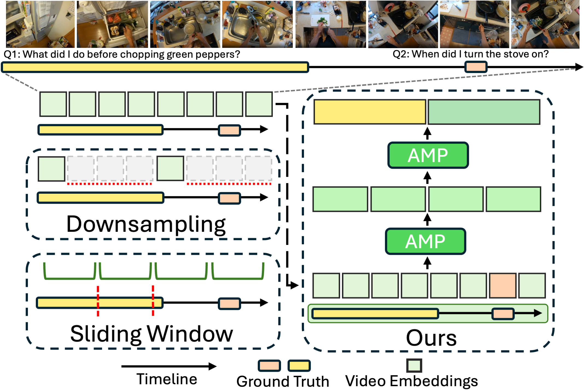

# HieraMamba: Video Temporal Grounding via Hierarchical Anchor-Mamba Pooling

[](https://arxiv.org/abs/2510.23043)
[](https://vision.cs.utexas.edu/projects/hieramamba/)

**Authors:** [Joungbin An](https://sites.google.com/view/joungbinan/), [Kristen Grauman](https://www.cs.utexas.edu/~grauman/)

> **📢 Initial Release Notice**  
> This is the **initial code release** containing **Anchor-MambaPooling (AMP) blocks**, the core blocks for HieraMamba implementation.  
> **Full model, training & evaluation codes, and pre-trained checkpoints** will be released soon.

## 🧭 Overview

HieraMamba utilizes **Mamba’s selective state-space modeling** to achieve **hierarchical, linear-time temporal grounding** in long, untrimmed videos. It introduces **Anchor–MambaPooling (AMP) blocks**, which hierarchically compress video embeddings into multi-scale anchor tokens, enabling precise and scalable moment localization across varying temporal spans. Designed for **long-video understanding**, HieraMamba preserves full temporal fidelity while maintaining efficiency, achieving **state-of-the-art results** on **Ego4D-NLQ**, **MAD**, and **TACoS** benchmarks.



## ✨ Key Features

- **🪜 Hierarchical Linear-Time Architecture**  
  Scales efficiently to **hour-long videos** with full temporal fidelity using a **linear-time** grounding framework.

- **🧱 Anchor–MambaPooling (AMP) Blocks**  
  Introduces **content-aware anchor tokens** via Mamba’s selective state-space modeling, enabling **multi-scale temporal reasoning**.

- **🏗️ Multi-Scale Video Pyramid**  
  Builds a **temporal hierarchy** that jointly captures fine actions and long-range dependencies for precise grounding.

- **🎯 Dual Contrastive Objectives**  
  Combines:  
  • **ACC** – aligns anchors with local frames (structural compactness)  
  • **SPC** – contrasts ground-truth segments with negatives (semantic precision)

- **⚡ Linear-Time Global Context**  
  Achieves **Transformer-level accuracy** with **O(L)** complexity through bidirectional Mamba scanning.

- **🏆 State-of-the-Art Results**  
  Outperforms strong baselines (**SnAG**, **RGNet**, **DeCafNet**) on **Ego4D-NLQ**, **MAD**, and **TACoS** benchmarks.


## Installation

### Quick Installation
```bash
# Clone the repository with submodules
git clone --recursive https://github.com/jbistanbul/hieramamba.git
cd hieramamba

# Run the installation script
./install.sh
```

### Manual Installation
```bash
# Clone the repository with submodules
git clone --recursive https://github.com/jbistanbul/hieramamba.git
cd hieramamba

# Install Mamba SSM following official instructions:
# https://github.com/state-spaces/mamba

# Install other dependencies
pip install -r requirements.txt
```

**Note:** This repository uses Hydra as a git submodule. Make sure to clone with `--recursive` or run `git submodule update --init --recursive` after cloning.

## Model Checkpoints

Pre-trained model checkpoints will be made available for each of the Long Video Temporal Grounding Datasets, including Ego4D-NLQ, MAD & MAD-v2, and TACoS.

## Training
Coming Soon

## Evaluation
Coming Soon

## Todos

- [ ] HieraMamba Training Code & Checkpoints
- [ ] Full HieraMamba Code
- [x] Anchor-MambaPooling (AMP) Block Code


## Citation

If you find HieraMamba useful for your research and applications, please consider giving a star ⭐ and citing it using this BibTeX:

```bibtex
@article{an2025hieramamba,
  title={HieraMamba: Video Temporal Grounding via Hierarchical Anchor-Mamba Pooling},
  author={An, Joungbin and Grauman, Kristen},
  journal={arXiv preprint arXiv:2510.23043},
  year={2025}
}
```
